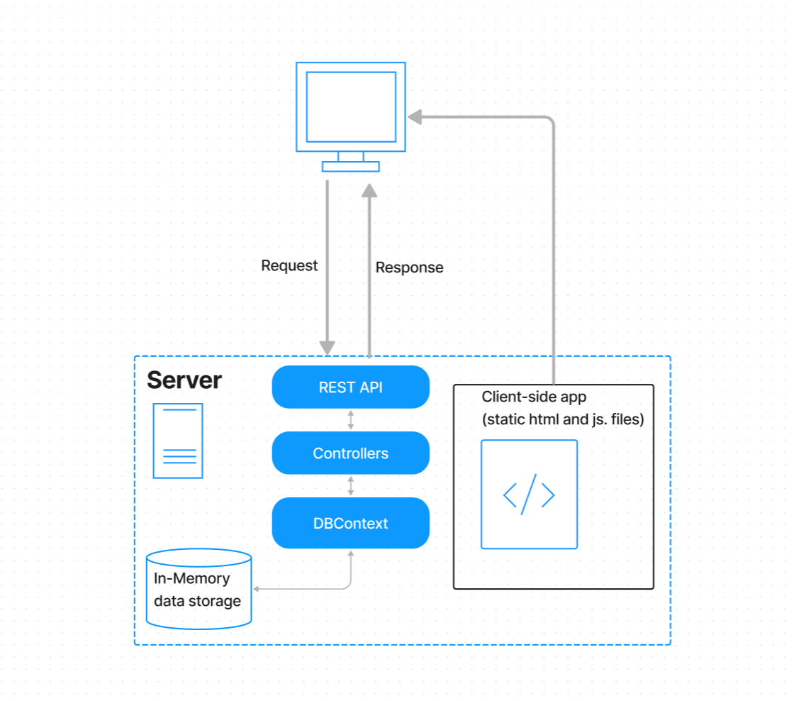

# IS27 - Full Stack Developer Coding Challenge for REQ97670
## submission by Daniel Walker

This is my submission for the coding challenge for the full stack deleveloper position at the BC Ministry of Citizens' Services. This application is a basic web app consisting of a RESTful API build in ASP.NET Core with an in-memory database context, and a front-end single page web app built with Svelte. The app is deployed to Azure App Services, and can be [accessed here.](https://danielwalker-is27fsdcc.azurewebsites.net/)

The app presents a hierarchical view of a staff directory for a hypothetical organization. The positions in the organization are shown in a tree-list type component, with the position number and title listed, and lower level positions nested within the "parent" position. If an employee in the organization is assigned to a position, their name and employee number are listed alongside the position details. Otherwise the position is listed as vacant. The the list also allows you modify the underlying data in the following ways:
- Assign an employee to a vacant position, using the "Assign Employee" buttons (opens a list of all employees, use "Select" to assign the employee)
- Unassign an employee from a position,using the "Unassign" buttons
- Change the name of an assigned employee, using the "Edit" buttons (opens a form with inputs to change name info, use "Save" to confirm the changes)
  - Currently there is no way to directly change the name of an employee not assigned to a position. You have to assign them, change their name, then unassign them.
- Add a new position under an existing one, with the "New Subordinate Position" buttons (opens a form with inputs to set position number and title, use "Save" to create the new position)
  - Currently there is no way to remove a position from the hierarchy


### Application Architecture



This application uses a standard .NET Core API design. The API enpoints are routed by controllers which access and update data through a dbcontext. For simplicity, the front end of the application is served from the same web server, but it would also be possible to serve them from a different server. The source files are compiled into static html and .js files so this would probably be quite simple.

### CI/CD
When publishing the app to Azure Web Services, I was able to add a CI/CD pipeline with GitHub Actions that would automatically build and deploy the app to Azure. Later I added a second pipeline that builds the app whenever a pull request is creatd. Unfortunately, the pipelines don't seem to work now as I have run out of space with GitHub Storage.

### Instructions to build and run locally

1. Install [Node.js](https://nodejs.org/en)
2. Clone the repository
3. Open the folder IS27_FSDCC_API in a terminal and run these commands:
  ```
  npm install
  npm run dev
  ```
4. The app should now be running locally. By default the app will open to the Swagger UI page for the API. Remove `/swagger/index.html` from the end of the URL to see the app running.


### Deploying to Azure App Services

This was my first time deploying a cloud hosting service. I used the publishing tools in Visual Studio which walked me through most of the process. I would recomend cunsulting a guide like [this one.](https://learn.microsoft.com/en-us/azure/app-service/quickstart-dotnetcore?tabs=net60&pivots=development-environment-vs)


 
